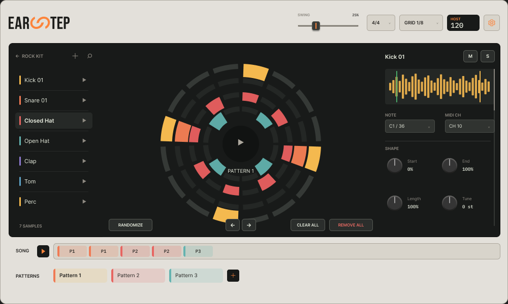

# earStep

**earStep** is a free circular drum/sample sequencer by **Alex Ears**.

## Download

**[Download earStep v1.0.0](../../releases/tag/v1.0.0)**

Release assets:
- macOS Universal — DMG / PKG
- Windows x64 — Setup EXE
- Linux x86_64 — DEB / TAR.GZ

> macOS and Windows builds are currently unsigned. Gatekeeper or SmartScreen may show a warning during installation. See the [installation notes](INSTALL.md).

## Features

- Circular step-sequencer workflow
- Sample-based drum and percussion sequencing
- Host tempo sync and Swing
- Adjustable Grid
- Per-step velocity, probability and ratchet controls
- Multiple interface themes
- Standalone version for use without a DAW

## Formats

| Platform | Formats |
| --- | --- |
| macOS | VST3, AU, Standalone |
| Windows x64 | VST3, Standalone |
| Linux x86_64 | VST3, Standalone |

## Installation

See **[INSTALL.md](INSTALL.md)** for platform-specific installation notes.

## Status

**v1.0.0** is the first public freeware release of earStep.

The source code is currently private. earStep is **not an open-source project**.

## Author / contact

**by Alex Ears**  
Telegram: [@Alexears](https://t.me/Alexears)

## License

Freeware for end users. Redistribution of the application or source code is not granted unless explicitly permitted by the author.
